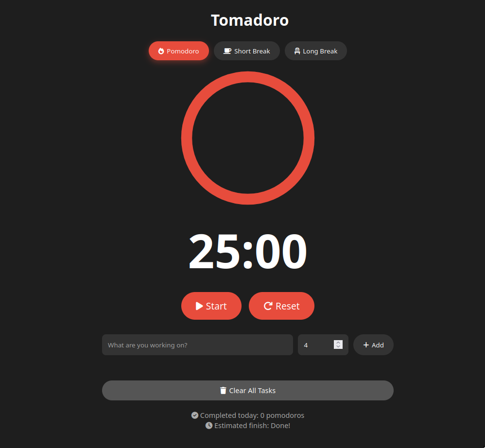

# 🍅 Tomadoro

A  minimal Pomodoro timer app for task time expenditure tracking. Inspired by [pomofocus.io](https://pomofocus.io).

## How it looks
  

## Features

- ⏱️ **Pomodoro Timer** - 25-minute focus sessions with configurable breaks
- 📋 **Task Management** - Add, track, and manage your tasks with estimated pomodoros
- 🔔 **Audio Notifications** - Get notified when your timer completes
- ⌨️ **Keyboard Shortcuts** - Quick controls without your mouse
- 📊 **Statistics** - Track completed pomodoros and estimated finish time
- 🎨 **Dark Mode** - Minimal, distraction-free interface
- ⚡ **No Dependencies** - Pure vanilla JavaScript, HTML, and CSS
- 💾 **Persistent Workflow** - Maintains your task state during the session

## Installation

1. Clone the repository:
```bash
git clone https://github.com/kithenry/Tomadoro.git
cd Tomadoro
```

2. Open in your browser:
```bash
# Simply open src/index.html in your web browser
open src/index.html
```

Or serve it with any simple HTTP server:
```bash
# Using Python 3
python -m http.server 8000

# Using Node.js
npx http-server
```

## Usage

### Timer Modes
- **Pomodoro (25 min)** - Focus session
- **Short Break (5 min)** - Quick break between pomodoros
- **Long Break (15 min)** - Extended break after 4 pomodoros

### Managing Tasks

1. **Add a task**: Type task name, select estimated pomodoros, press Enter or click "Add"
2. **Log work**: Click the + button to mark a pomodoro as completed
3. **Reduce estimate**: Click the - button if you overestimated
4. **Mark complete**: Check the checkbox when task is done
5. **Delete**: Click the trash icon to remove a task
6. **Clear all**: Use "Clear All Tasks" button with confirmation

### Keyboard Shortcuts

| Key | Action |
|-----|--------|
| `Space` | Start/Pause timer |
| `1` | Switch to Pomodoro |
| `2` | Switch to Short Break |
| `3` | Switch to Long Break |
| `R` | Reset current timer |
| `Enter` | Add task (when typing) |

## How It Works

1. **Work Phase**: For focusing during a 25-minute pomodoro
2. **Track Progress**: Pomodoros marked complete as they are  completed
3. **Break Time**: Timer automatically switches to break mode when pomodoro ends
4. **Cycle Tracking**: After 4 pomodoros, user gets a 15-minute long break
5. **Notifications**: Visual and audio feedback when sessions complete

## Architecture

```
Tomadoro/
├── src/
│   ├── index.html      # UI structure & styling
│   └── index.js        # Timer logic & task management
└── README.md           # This file
```

### Technology Stack
- **HTML5** - Semantic markup
- **CSS3** - Responsive styling with animations
- **JavaScript (ES6)** - Core functionality
- **Font Awesome 6** - Icons
- **Web Audio API** - Notification sounds

## Features Overview

### ✅ Implemented
- [x] Pomodoro timer with three modes
- [x] Task management system
- [x] Keyboard shortcuts
- [x] Progress tracking
- [x] Auto-switch between modes
- [x] Session notifications
- [x] Audio alerts
- [x] Task clearing with confirmation
- [x] Increment/decrement pomodoros per task
- [x] Font Awesome icons
- [x] Toast notifications 
- [x] Reset button triggers pomodoro mode
- [x] Enter key adds tasks
- [x] Fixed spacebar interference with inputs

### 🚀 Potential Future Enhancements
- [ ] Projects/categories for tasks
- [ ] Sub-tasks with nesting
- [ ] Local storage persistence
- [ ] Statistics dashboard
- [ ] Dark/light theme toggle
- [ ] Custom break durations
- [ ] Sound selection

## Known Issues

See the [Issues](https://github.com/kithenry/Tomadoro/issues) page for current work-in-progress items.

## Contributing

Contributions are welcome! Feel free to:
1. Fork the repository
2. Create a feature branch
3. Make your changes
4. Submit a pull request

## License

This project is open source and available for personal and commercial use.

## Inspiration

Built as a clone of the excellent [pomofocus.io](https://pomofocus.io) for learning and task tracking purposes.
